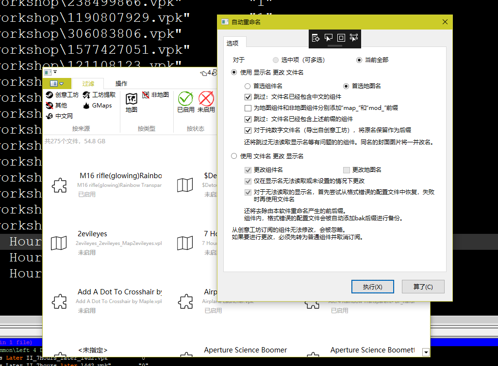

# L4d2AddonsMgr

A partially-functional useless Windows WPF Application that helps managing your addons for Left 4 Dead 2.

You won't need this unless you also have hundreds of addons (incl. maps) downloaded.

**warning** : strings within the app are all in Chinese Simplified.

## Features

* Enable/disable addons within click.
* Search by addon's file name *or* display name.
* Filter by downloaded source, is map or not, enabled state and more.
* Rename selected files to their actual displayed name.
* To be continued whenever new features are readlly needed by the `Cat`.

